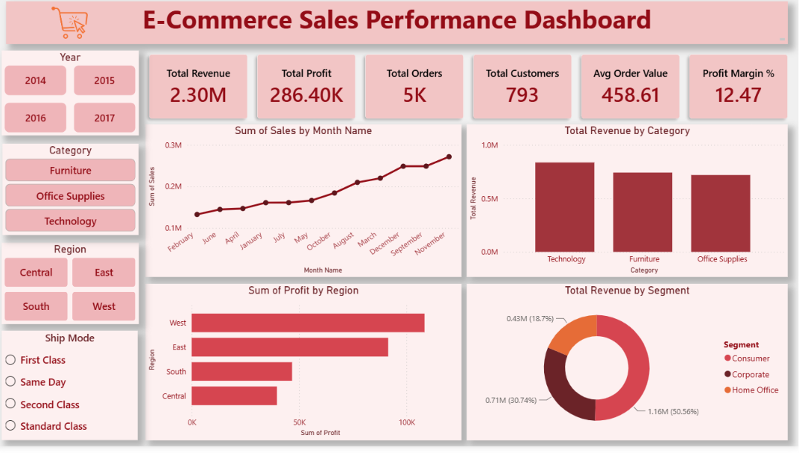

# 📊 E-Commerce Sales & Customer Behavior Analysis

> End-to-End Data Analytics Project using **Excel, Python, PostgreSQL, and Power BI**


---

# 📌 Project Overview

This project is a complete **End-to-End Data Analytics Case Study** based on the **Superstore Sales Dataset**.

The objective of this project is to analyze historical sales transactions, understand customer purchasing behavior, identify business trends, and build an interactive Power BI dashboard that supports data-driven decision-making.

The project follows the complete analytics workflow used in industry:

> Business Problem → Excel → Python → PostgreSQL → Power BI → Business Insights

---

# 🎯 Business Problem

An e-commerce company wants to better understand its sales performance and customer behavior.

The management team wants answers to questions such as:

- Which products generate the highest revenue?
- Which product categories are most profitable?
- Which regions perform the best?
- Who are the highest-value customers?
- Are there seasonal sales trends?
- What factors influence business profitability?

The objective is to transform raw sales data into meaningful business insights that can help management make strategic decisions.

---

# 🎯 Project Objectives

- Clean and validate raw sales data.
- Perform Exploratory Data Analysis (EDA).
- Analyze sales performance across categories and regions.
- Understand customer purchasing behavior.
- Perform SQL-based business analysis.
- Develop an interactive Power BI dashboard.
- Generate business insights and recommendations.

---

# 🛠 Tools & Technologies

| Tool | Purpose |
|------|----------|
| Microsoft Excel | Data Cleaning & Pivot Analysis |
| Python (Pandas, NumPy, Matplotlib, Seaborn) | Exploratory Data Analysis |
| PostgreSQL | Business Querying & SQL Analysis |
| Power BI | Interactive Dashboard |
| Git & GitHub | Version Control & Portfolio |

---

# 📂 Project Workflow

```text
Raw Dataset
      │
      ▼
Excel
(Data Cleaning + Pivot Tables)
      │
      ▼
Python
(EDA + Feature Engineering)
      │
      ▼
PostgreSQL
(Business SQL Analysis)
      │
      ▼
Power BI
(Interactive Dashboard)
      │
      ▼
Business Insights
```

---

# 📁 Dataset

**Dataset:** Sample Superstore Dataset

Contains information about:

- Orders
- Customers
- Products
- Categories
- Regions
- Sales
- Profit
- Quantity
- Discounts
- Shipping

---

# 📊 Excel Analysis

Performed:

- Data Cleaning
- Missing Value Validation
- Duplicate Check
- Date Formatting
- Pivot Tables
- Pivot Charts

Created Pivot Reports:

- Revenue by Category
- Revenue by Region
- Monthly Sales Trend
- Top Products
- Segment Analysis

---

# 🐍 Python Analysis

Performed complete Exploratory Data Analysis (EDA).

### Data Cleaning

- Checked missing values
- Removed duplicates
- Converted date columns
- Created new features

### Feature Engineering

Created:

- Year
- Month
- Quarter
- Shipping Days
- Profit Margin

### EDA

- Univariate Analysis
- Bivariate Analysis
- Multivariate Analysis

### Visualizations

- Sales Distribution
- Profit Distribution
- Monthly Sales Trend
- Revenue by Category
- Discount vs Profit
- Correlation Heatmap
- Sales by Region
- Customer Analysis

---

# 🗄 PostgreSQL Analysis

Performed SQL analysis using PostgreSQL.

Key business questions answered:

- Total Revenue
- Total Profit
- Total Orders
- Total Customers
- Revenue by Category
- Profit by Region
- Top Products
- Top Customers
- Monthly Sales
- Quarterly Sales
- Customer Segment Analysis
- Discount Impact
- Product Ranking
- Revenue Contribution

SQL concepts used:

- GROUP BY
- HAVING
- Aggregate Functions
- CASE WHEN
- Window Functions
- ROW_NUMBER()
- RANK()
- CTE
- Date Functions

---

# 📈 Power BI Dashboard

The final dashboard provides an executive-level overview of business performance.

### Dashboard Features

- KPI Cards
- Monthly Sales Trend
- Revenue by Category
- Profit by Region
- Sales by Customer Segment
- Interactive Slicers
- Dynamic Filtering

---

# 📌 Key Performance Indicators (KPIs)

- Total Revenue
- Total Profit
- Total Orders
- Total Customers
- Average Order Value
- Profit Margin %

---

# 📊 Dashboard Preview



---

# 📈 Business Insights

## Overall Performance

- Generated **$2.30 Million** in revenue.
- Achieved **$286.40K** total profit.
- Processed **5,009** customer orders.
- Served **793** unique customers.

---

## Category Insights

- Technology generated the highest revenue.
- Furniture produced high sales but lower profitability.
- Office Supplies maintained consistent performance.

---

## Regional Insights

- West region generated the highest profit.
- East region ranked second.
- Central region showed improvement opportunities.

---

## Customer Insights

- Consumer segment contributed over 50% of total revenue.
- Repeat customers significantly contributed to overall sales.

---

## Seasonal Trends

- Sales peaked during Quarter 4.
- November recorded the highest monthly sales.

---

# 💡 Business Recommendations

- Increase investment in Technology products.
- Review pricing strategy for Furniture.
- Focus marketing efforts in high-performing regions.
- Launch customer loyalty programs.
- Increase inventory before Quarter 4.
- Reduce excessive discounts on low-margin products.

---

# 📂 Repository Structure

```
E-Commerce-Sales-Analysis/
│
├── Dataset/
│      Sample-Superstore.csv
│
├── Excel/
│      Superstore_Analysis.xlsx
│
├── Python/
│      EDA.ipynb
│
├── PostgreSQL/
│      SQL_Queries.sql
│
├── PowerBI/
│      Dashboard.pbix
│
├── Images/
│      Dashboard.png
│
├── Report/
│      Business_Insights_Report.pdf
│
└── README.md
```

---

# 📊 Skills Demonstrated

- Data Cleaning
- Data Wrangling
- Exploratory Data Analysis
- Data Visualization
- SQL Querying
- Window Functions
- Business Intelligence
- Dashboard Design
- KPI Reporting
- Business Storytelling

---

# 📚 Key Learnings

Through this project, I learned:

- End-to-end analytics workflow
- Data preprocessing techniques
- Business-oriented SQL analysis
- Power BI dashboard development
- Data storytelling
- Business insight generation
- Converting raw data into actionable recommendations

---

# 🚀 Future Improvements

- Sales Forecasting using Machine Learning
- Customer Segmentation (RFM Analysis)
- Predictive Analytics
- Customer Lifetime Value (CLV)
- Automated ETL Pipeline
- Real-time Dashboard

---

# 👨‍💻 Author

**Saniraj Desai**

Aspiring Data Analyst

- Email: *(Add your Email)*

---

# ⭐ If you found this project useful, please consider giving it a Star!
